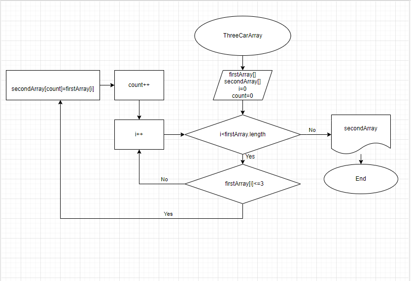

Расположение файлов в папке FinalTest
- Описание решения и алгоритм в формате (png) 
README.md > Solution Description.md
- Алгоритм метода сортировки строк из 3-х символов и менее в формате (png)
README.md > Algorithm.png
в формате (drawio)
Algoritm
-Программа решения задачи
Task > Program.cs
Описание решения:

1. Задаём первый массив с набором символов.
2. Проверяем если индекс массива меньше длины массива переходим по стрелке Yes.
3. Проверяем если строка массива с индексом i меньше или равна 3 переходим по стрелке Yes.
4. Вставляем во второй массив строку с первого массива.
5. Затем прибавляем count+1, затем i+1, переходим к п. 2.
6. П. 3 если строка массива с индексом i больше 3 переходим по стрелке No.
7. Затем прибавляем i+1.
8. После прохождения всего массива по данному кругу, когда индекс массива будет равен длине первого массива, переходим по стрелке No.
9. В итоге получаем второй массив с отсортированными строками меньше или равными трём символам.

